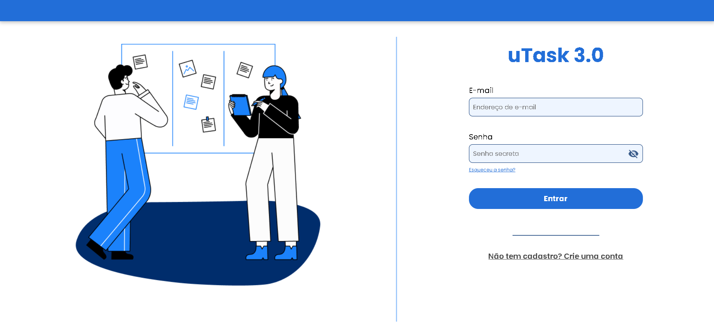
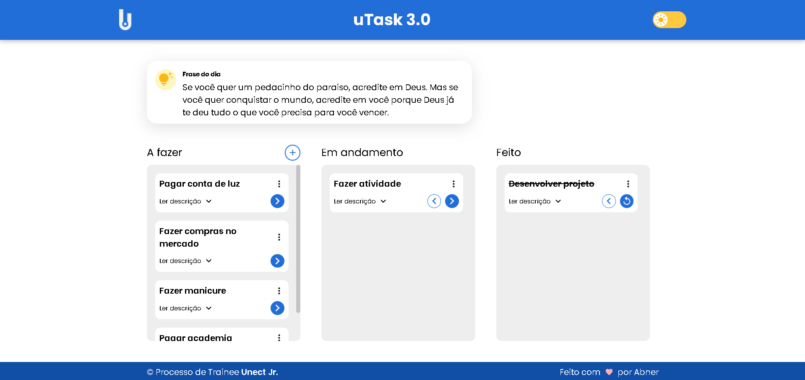
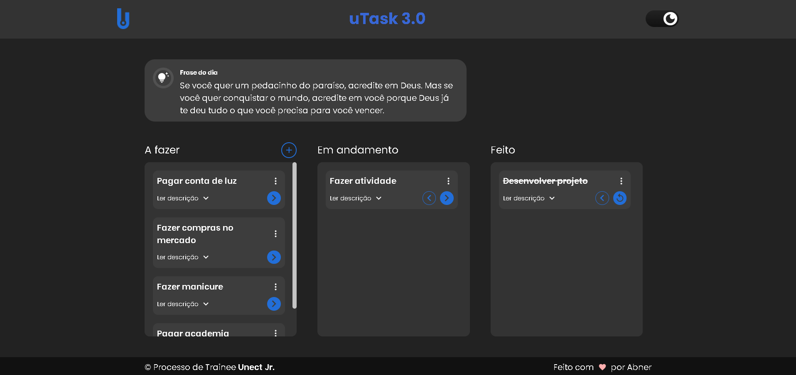

<h3 align="center">Projeto Trainee - Unect Jr.</h3>

<p align="center"> O objetivo deste projeto era desenvolver uma landing page de uma cafeteria fictícia, utilizando dos recursos e conhecimentos fornecidos pelas capacitações durante o processo trainee da empresa júnior.
    <br> 
</p>

<div align="center">
  <a href="https://unect.com.br/">Unect Jr.</a>
</div>

## 📝 Table of Contents

- [About](#about)
- [Usage](#usage)
- [Built](#built_using)
- [Team](#team)

## 🧐 About <a name = "about"></a>


<br>

O desafio incluiu as seguintes etapas:

- **Prototipação:** Analisar o design do Figma e componentizar o que era possível dentro das páginas, para poder estruturar a interface mais fiel possível ao seu design original.
- **Front-end:** Com base no layout disponível, deveria realizar a codificação da interface previamente prototipada ao mesmo tempo que tornava sua visualização agradável e responsiva utilizando o React.
- **Back-end:** Implementar a lógica de negócio, desenvolvendo APIs para garantir a comunicação entre a interface e o banco de dados através de pacotes que simulavam o back-end da aplicação (json-server e axios).
- **Funcionalidades:** Cadastro e autenticação do usuário, bem como a criação, remoção e distribuição de tarefas num quadro kanban, com opção de visualizar a tela no modo claro e escuro, além da responsividade para uma tela mobile.
<br>




## 🚀 Usage <a name="usage"></a>

Para rodar o projeto localmente, siga os seguintes passos:

1. Clone o repositório:

```bash
git clone https://github.com/abnerns/projeto-utask.git
```

2. Instale as dependências na pasta do projeto:

```bash
npm install
```

3. Execute os comandos abaixo em terminais diferentes para navegar até as pastas:

```bash
cd \projeto-utask
```

4. Inicie o Vite em terminais diferentes (front e back, respectivamente):

```bash
npm run dev
```

```bash
npm run server
```

5. Acesse o sistema em `http://localhost:5173`.

## ⛏️ Built Using <a name = "built_using"></a>

&nbsp;
&nbsp;
&nbsp;
&nbsp;

## ✍️ Team <a name = "team"></a>

- [Abner do Nascimento](https://github.com/abnerns) - Developer
- [Vitor Menck](https://github.com/vgmenck) - Scrum Master
- [Unect Jr.](mailto:unect@unect.com.br) - Product Owner